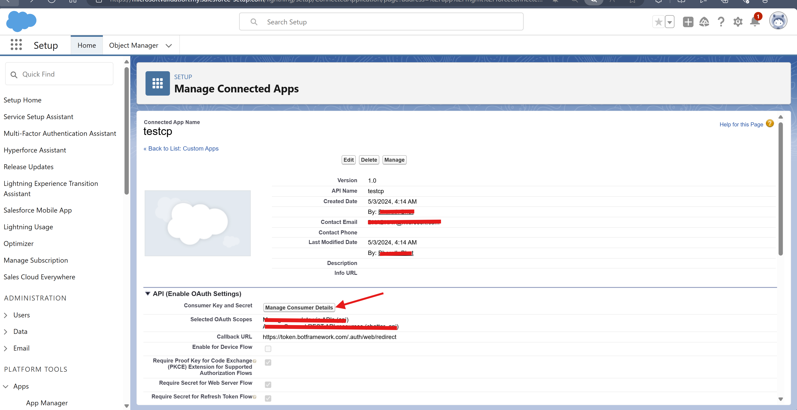

# Overview of Custom Search Results template

This app template is a search-based [message extension](https://docs.microsoft.com/microsoftteams/platform/messaging-extensions/what-are-messaging-extensions?tabs=nodejs) that allows users to search an external system and share results through the compose message area of the Microsoft Teams client. You can now build and run your search-based message extensions in Teams, Copilot for Windows desktop and web experiences.

## Get started with the template

> **Prerequisites**
>
> To run the template in your local dev machine, you will need:
>
> - [Node.js](https://nodejs.org/), supported versions: 16, 18
> - A [Microsoft 365 account for development](https://docs.microsoft.com/microsoftteams/platform/toolkit/accounts)
> - Access to Salesforce environment to create connected App
> - [Set up your dev environment for extending Teams apps across Microsoft 365](https://aka.ms/teamsfx-m365-apps-prerequisites)
>   Please note that after you enrolled your developer tenant in Office 365 Target Release, it may take couple days for the enrollment to take effect.
> - [Teams Toolkit Visual Studio Code Extension](https://aka.ms/teams-toolkit) version 5.0.0 and higher or [Teams Toolkit CLI](https://aka.ms/teams-toolkit-cli)
> - Microsoft 365 Copilot enabled environment.
## Create connected App in Salesforce
1. Login to Salesforce and go to Settings --> App Manager --> New Connected App.

   - Fill in the details and create the API client.
   - Enable OAuth settings & ensure that the callback url is saved as https://token.botframework.com/.auth/web/redirect

   - Select appropriate scopes & enable the authorization & token exchange flow as required to ensure security while invoking the apis.

   - Once the app is created, select Manage Consumer Details. 
   - Enter the passcode sent to the email used while creating the app.

   - Note down the Client ID & Secret. We will need this while configuration the OAuth connection in Azure.

2. **Visual Studio Code - Teams toolkit:**
   - Select the Teams Toolkit icon on the left in the VS Code toolbar.
   - In the Account section, sign in with your [Microsoft 365 account](https://docs.microsoft.com/microsoftteams/platform/toolkit/accounts) if you haven't already.

3. **Login to Azure** & create a resource group to deploy the solution. Copy the subscription-id and resource group name.

4. **In Visual studio**, enter the values copied above in .env.dev file under env folder.
   

   - Using the Teams Toolkit menu, under Lifecycle - choose each of the options Provision & Deploy sequentially.  
   This will create the necessary configuration and deploy the app & bot in Azure within the Resource group created in earlier step above.

   - Wait for the deployment to be successfully completed.

5. **Login to Azure**  
   - Click on the bot created under the resource group. Check for Azure bot in the resource type column.

   - Select Configuration & click on `Add OAuth Connection Settings` button to enter the OAuth Connection details created in Step 1 & save the same.

   - Back in Configuration, copy the values for `BOT_ID`, `BOT_PASSWORD` by clicking on the edit options

6. **Using Visual Studio** Create .env file under the src folder and update the values for MicrosoftAppId(`BOT_ID`), MicrosoftAppPassword (`BOT_PASSWORD`) & connectionName (`OAuth Connection Name`):  

   - Redeploy the solution using the `Deploy` option from the Teams toolkit.

   - Click on `Publish` option from the Teams toolkit to create the App Package file.

7. Using a Teams environment with access to upload custom apps, 
   - upload the app package found appPackage\build folder using the `Upload an app` option.

8. To trigger the app as Message Extension, `@mention` Your message extension from the `search box area`, `@mention` your message extension from the `compose message area` or click the `...` under compose message area to find your message extension.

9. To trigger the Message Extension through Copilot as a Plugin, you can:
   a. Open the `Copilot` app and enable the plugin from Plugin popup list. 
   b. send a prompt to trigger your plugin.
      > Note: This prompt may not always make Copilot include a response from your message extension. If it happens, try some other prompts or leave a feedback to us by thumbing down the Copilot response and leave a message tagged with [MessageExtension].
**Congratulations**! You can now search salesforce opportunities in Teams via Copilot.

## What's included in the template

| Folder        | Contents                                     |
| ------------- | -------------------------------------------- |
| `.vscode/`    | VSCode files for debugging                   |
| `appPackage/` | Templates for the Teams application manifest |
| `env/`        | Environment files                            |
| `infra/`      | Templates for provisioning Azure resources   |
| `src/`        | The source code for the search application   |

The following files can be customized and demonstrate an example implementation to get you started.

| File               | Contents                                                                                       |
| ------------------ | ---------------------------------------------------------------------------------------------- |
| `src/searchApp.js` | Handles the business logic for this app template to query npm registry and return result list. |
| `src/index.js`     | `index.js` is used to setup and configure the Message Extension.                               |

The following are Teams Toolkit specific project files. You can [visit a complete guide on Github](https://github.com/OfficeDev/TeamsFx/wiki/Teams-Toolkit-Visual-Studio-Code-v5-Guide#overview) to understand how Teams Toolkit works.

| File                 | Contents                                                                                                                                  |
| -------------------- | ----------------------------------------------------------------------------------------------------------------------------------------- |
| `teamsapp.yml`       | This is the main Teams Toolkit project file. The project file defines two primary things: Properties and configuration Stage definitions. |
| `teamsapp.local.yml` | This overrides `teamsapp.yml` with actions that enable local execution and debugging.                                                     |

## Extend the template

Following documentation will help you to extend the template.

- [Add or manage the environment](https://learn.microsoft.com/microsoftteams/platform/toolkit/teamsfx-multi-env)
- [Create multi-capability app](https://learn.microsoft.com/microsoftteams/platform/toolkit/add-capability)
- [Add single sign on to your app](https://learn.microsoft.com/microsoftteams/platform/toolkit/add-single-sign-on)
- [Access data in Microsoft Graph](https://learn.microsoft.com/microsoftteams/platform/toolkit/teamsfx-sdk#microsoft-graph-scenarios)
- [Use an existing Microsoft Entra application](https://learn.microsoft.com/microsoftteams/platform/toolkit/use-existing-aad-app)
- [Customize the Teams app manifest](https://learn.microsoft.com/microsoftteams/platform/toolkit/teamsfx-preview-and-customize-app-manifest)
- Host your app in Azure by [provision cloud resources](https://learn.microsoft.com/microsoftteams/platform/toolkit/provision) and [deploy the code to cloud](https://learn.microsoft.com/microsoftteams/platform/toolkit/deploy)
- [Collaborate on app development](https://learn.microsoft.com/microsoftteams/platform/toolkit/teamsfx-collaboration)
- [Set up the CI/CD pipeline](https://learn.microsoft.com/microsoftteams/platform/toolkit/use-cicd-template)
- [Publish the app to your organization or the Microsoft Teams app store](https://learn.microsoft.com/microsoftteams/platform/toolkit/publish)
- [Develop with Teams Toolkit CLI](https://aka.ms/teams-toolkit-cli/debug)
- [Preview the app on mobile clients](https://github.com/OfficeDev/TeamsFx/wiki/Run-and-debug-your-Teams-application-on-iOS-or-Android-client)
- [Extend Microsoft 365 Copilot](https://aka.ms/teamsfx-copilot-plugin)
